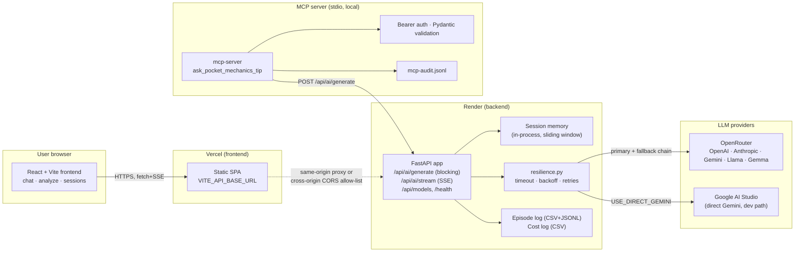

# Pocket Mechanics — Architecture

Higher-level system architecture for the Pocket Mechanics web app.
For the **agent** layer (single-agent pattern, AgentState, resilience
contract) see [`agent-architecture-lab7.md`](agent-architecture-lab7.md).

---

## 1. System diagram

---

## 2. Request flows

### 2.1 Text-only chat (`POST /api/ai/stream`)

1. Browser opens `fetch` POST to `/api/ai/stream` with `{message, session_id, model?}`.
2. Backend loads sliding-window history for `session_id` (`services/session_service.py`, last 20 turns × 2 + system).
3. `resilience.call_with_resilience` wraps the provider call (timeout, exponential backoff, OpenRouter fallback chain).
4. Provider streams token deltas; FastAPI re-emits them as SSE `data: {"token":"..."}\n\n`.
5. After completion, a `usage` event (`stream_start_ms`, `stream_end_ms`, `latency_ms`, token counts) and `data: [DONE]\n\n` close the stream.
6. Two episode-log entries land: `user_message` then `stream_end` (with cost, tokens, cache metrics, fallback flag).

### 2.2 Multimodal chat (image + question)

1. Frontend converts the attached file to a `data:image/...;base64,...` URL (HEIC/HEIF auto-converted to JPEG client-side).
2. Same stream endpoint accepts `images: string[]` alongside `message`.
3. `services/vision_utils.py` validates each data URL against `MAX_VISION_IMAGES` and `MAX_VISION_BYTES_PER_IMAGE`, then converts to provider-specific parts (Gemini parts / OpenRouter user content).
4. From there the flow is identical to text-only chat.

### 2.3 MCP tool call

1. MCP client (Inspector, Claude Desktop, etc.) spawns `python mcp-server/server.py` over stdio.
2. Tool invocation: `ask_pocket_mechanics_tip({question, vehicle_hint})`.
3. `mcp-server/auth.py` checks the bearer header (`hmac.compare_digest` against `MCP_SECRET_KEY`).
4. `mcp-server/validated_tool.py` runs Pydantic validation on the args.
5. Tool issues HTTP `POST /api/ai/generate` to the running backend (real model answer, no duplicate model logic).
6. Result + `mcp_tool_call` entries are written to `logs/mcp-audit.jsonl` and the backend's `episode-log.csv`.
7. On internal errors the response is sanitised to `{"error":"<code>"}` — no traceback or filesystem paths.

---

## 3. Component responsibilities

| Component | Responsibility | Source |
|-----------|----------------|--------|
| `Frontend/` | UI, session id management (`useSession`, `sessionStorage.ts`), SSE consumer (`useStream`), image-to-data-URL conversion (`api.ts`) | Vite SPA |
| `Backend/routers/ai_router.py` | Blocking `POST /api/ai/generate` (Lab 5) | FastAPI |
| `Backend/routers/stream_router.py` | SSE `POST /api/ai/stream` (Lab 6) with vision support | FastAPI |
| `Backend/routers/models_router.py` | `GET /api/models` for the frontend ModelSelect | FastAPI |
| `Backend/services/llm_service.py` | Provider abstraction (OpenRouter + Gemini), fallback chain, prompt caching | Python |
| `Backend/services/resilience.py` | Timeout, exponential backoff, episode-log retries | Python |
| `Backend/services/vision_utils.py` | Image validation + provider-format conversion | Python |
| `Backend/services/session_service.py` | In-process session memory, sliding-window trim | Python |
| `Backend/services/episode_logger.py` | CSV + JSONL audit log writers | Python |
| `mcp-server/` | Stdio MCP server with auth, validation, audit | Python |
| `eval/` | Golden set, LLM-as-judge runner, regression test (`tests/test_regression.py`) | Python |
| `orchestration/langgraph_mini/` | LangGraph proof (research → write → human_review) | Python |

---

## 4. Provider strategy

- **Default in production:** OpenRouter with `DEFAULT_MODEL=google/gemini-2.5-flash`. Multimodal + cheap + fast.
- **Fallback chain:** when the primary fails (5xx, timeout, content-filter), `llm_service` walks `OPENROUTER_FALLBACK_MODELS` (defaults to `openai/gpt-5.5` → `deepseek/deepseek-v4-flash`). The `fallback_triggered` field in the episode log marks rows that landed on a non-primary model.
- **Cross-vendor coverage:** through OpenRouter the same client reaches Google (`gemini-2.5-flash`), OpenAI (`gpt-5.5`), and DeepSeek (`deepseek-v4-flash`) — benchmarked across all three in `eval/model-comparison.json` — with one credential.
- **Dev path:** `USE_DIRECT_GEMINI=true` + `GEMINI_API_KEY` bypasses OpenRouter so the team can iterate without spending the shared OpenRouter budget.
- **Prompt caching:** when the active model is an Anthropic OpenRouter slug, the system prompt is wrapped with `{"cache_control": {"type": "ephemeral"}}`; benchmark and savings in [`optimization-report.md`](optimization-report.md).

---

## 5. Storage & observability

| Sink | Path | Format | Purpose |
|------|------|--------|---------|
| Episode log | `Backend/logs/episode-log.csv` + `episode-log.jsonl` | CSV + JSONL | Per-call audit: tokens, cost, latency, cache, retries, fallback |
| Cost log | `Backend/logs/cost-log.csv` | CSV | Lab 5 cost roll-up for `/api/ai/generate` |
| MCP audit | `logs/mcp-audit.jsonl` | JSONL | MCP tool invocations: auth result, input hash, latency, sanitised error |
| Session memory | in-process Python dict | n/a | Sliding window per `session_id`; lost on restart by design (privacy) |
| Frontend session id + chat | `localStorage` (browser) | JSON | Survives reload, scoped per browser; cleared by user via "New chat" |

There is no database. The product is intentionally stateless server-side beyond the in-process session map — every persisted chat history lives on the user's own device.

---

## 6. Deployment topology

- **Frontend** → Vercel static deploy. `VITE_API_BASE_URL` baked at build time points at the Render backend origin.
- **Backend** → Render web service. Uses `uv` to install from `Backend/uv.lock`, runs `uvicorn main:app --host 0.0.0.0 --port $PORT`.
- **MCP server** → local stdio process (spawned by MCP-aware clients). Not currently hosted as a service.
- **CI/CD** → `.github/workflows/ci-cd.yml` — scope-detected blue-green deploy: only the affected pipeline runs when only frontend or only backend changes.

Full deployment runbook: [`docs/DEPLOYMENT.md`](DEPLOYMENT.md).

---

## 7. Security boundaries

| Boundary | Control |
|----------|---------|
| Browser → backend | CORS allow-list in `Backend/main.py` (`FRONTEND_ORIGINS`); optional `Authorization: Bearer` plumbing in `Frontend/src/lib/api.ts` |
| MCP client → MCP server | Bearer auth (`mcp-server/auth.py`, `hmac.compare_digest` against `MCP_SECRET_KEY`) |
| MCP server → backend | HTTP POST over loopback to `/api/ai/generate` — no public exposure |
| Backend → provider | API key in env only; no keys in logs (`docs/data-map.md`) |
| Logs | No PII: `session_id` labels are random IDs, no user text in cost log, image bytes never persisted |
| Git | `.env*` ignored; `git log -- .env Backend/.env` returns no commits ([`docs/evidence/git-env-check.txt`](evidence/git-env-check.txt)) |

---

## 8. Why this shape

- **Single backend service** — every model call goes through one path with one resilience policy, one log schema, one cost meter.
- **Provider abstraction in `llm_service.py`** — adding a new provider is one factory function; the routers don't know which backend served them.
- **MCP delegates to the same HTTP endpoint** — no duplicate model orchestration logic between MCP and the web UI.
- **No database** — privacy, simplicity, deploy speed. Sessions in memory; user history on the user's device.
- **CSV + JSONL episode log side-by-side** — CSV for spreadsheets and grading, JSONL for `jq` / streaming pipelines.
